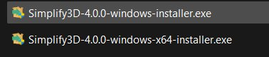
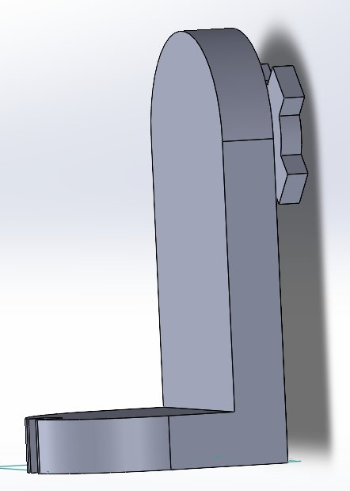
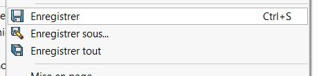
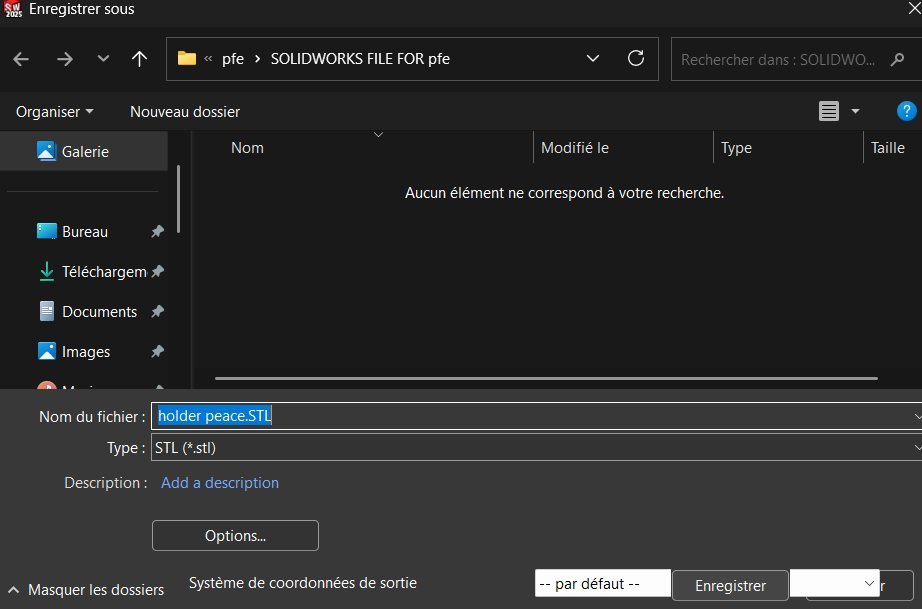
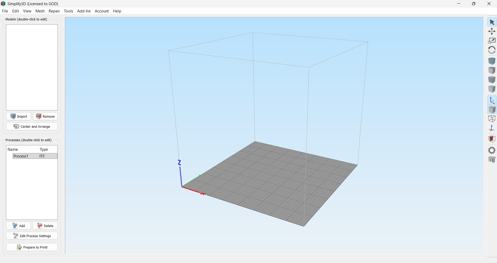
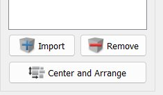
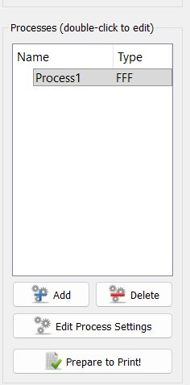
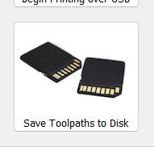

# GUIDE-OF-TELECOMMUNICATION-LAB-OF-SCIENCES-AND-TECHNOLOGIES-FACULTY-ABOUBAKER-BELGUAID-TLEMCEN
This repo is a guide for the use of the 3D printing machine in the lab of telecommunications in the ST faculty / Aboubacker Belgaid in Tlemcen. The use must be perfect to reduce waste of materials, time, and costs. Please read it carefully and follow the steps for a better experience. 

# 🖨️ CoLiDo Cubic 3D Printer — Lab Usage Guide

> **Telecommunications Laboratory — Faculty of Sciences and Technologies**
> Aboubaker Belkaïd University, Tlemcen

This guide covers the complete workflow for using the **CoLiDo Cubic** FDM 3D printer in the lab. Follow each step carefully to minimize waste of materials, time, and costs.

---

## 📋 Table of Contents

1. [Software Installation (Simplify3D)](#1-software-installation-simplify3d)
2. [Printer Setup & Calibration](#2-printer-setup--calibration)
3. [Printing Workflow](#3-printing-workflow)
4. [Printer Specifications & Settings](#4-printer-specifications--settings)

---

## 1. Software Installation (Simplify3D)

The slicer used in this lab is **Simplify3D v4.0.0** — it converts your 3D model into G-code that the printer can execute.

### Installation Steps

1. Open the files attached to this repository and locate one of the following installers depending on your system:

   - `Simplify3D-4.0.0-windows-installer.exe` *(32-bit)*
   - `Simplify3D-4.0.0-windows-x64-installer.exe` *(64-bit — recommended)*

2. Run the installer and follow the on-screen steps until completion, then close the installer.

3. Navigate to the folder where Simplify3D was installed.

4. Find the file named `Interface.dll` and **rename it** to `Interface.dl1` (replace the last letter `l` with the number `1`).

5. Copy the `Interface.dll` file from the **crack folder** in this repository and paste it into the same installation directory.

6. Simplify3D is now ready to use.

> ⚠️ If you encounter installation issues, refer to the README file included inside the crack folder.

---

## 2. Printer Setup & Calibration

### Turn On & Pre-heat

1. Connect and power on the printer.
2. On the printer menu, go to **Preheat** → select **Cool** (to start at a neutral state).

### Homing & Z-Axis Setup

3. Go to **Control** → set the printer to **Home Position**.
4. Adjust the Z-axis so the gap between the nozzle and the print bed is approximately **1 mm**.

### Bed Leveling

5. Using the **motor control mode**, position the nozzle over each corner of the print bed.
6. For each corner, slide a thin sheet of paper between the nozzle and the bed.
7. Adjust the screw beneath the bed: tighten until the paper is held firmly, then loosen just until the paper can slide with slight resistance.
8. Repeat for all four corners.

✅ The bed is now calibrated and you are ready to print.

---

## 3. Printing Workflow

### Step 1 — Design Your 3D Model

Use any 3D modeling tool to design your object. A recommended option for engineering work is **SolidWorks**.

### Step 2 — Save & Export as STL

First, save your project file in its native format for future edits:

Then export it as a `.stl` file — this format is readable by Simplify3D and all standard slicer software:

### Step 3 — Open Simplify3D & Import Your Model

Launch Simplify3D. You will see the main interface with the virtual print bed:

Click the **Import** button and select your `.stl` file:

### Step 4 — Position the Model & Prepare to Print

Orient your model on the virtual print bed to minimize print time, material usage, and the need for support structures.

> 💡 **Tip:** Any part of the model suspended in mid-air and far from a continuous vertical support will require support material. Avoid supports whenever possible by rotating the object.

Once satisfied with positioning, click **Prepare to Print!**:

### Step 5 — Slice & Save G-code to USB

Review the estimated print time, layer preview, and settings. When ready, click **Save Toolpaths to Disk** and save the `.gcode` file directly to your USB flash drive:

### Step 6 — Print

Insert the USB flash drive into the printer, select the file from the printer's menu, and start the print.

---

## 4. Printer Specifications & Settings

**Printer:** CoLiDo Cubic  
**Type:** FDM (Fused Deposition Modeling)  
**Nozzle diameter:** 0.4 mm  
**Filament diameter:** 1.75 mm  
**Supported materials:** PLA, ABS, TPU  

### Recommended Slicer Settings

| Setting | Recommended Value |
|---|---|
| Layer Height | 0.2 mm |
| Print Speed | 40 – 50 mm/s |
| Nozzle Temperature | 200 – 210 °C (PLA) |
| Bed Temperature | 55 – 60 °C |
| Infill | 15 – 20% (standard parts) |
| Cooling Fan | 100% (PLA) |
| Support Structures | Only when necessary |

---

## 📝 Notes

- For advanced settings, refer to the official Simplify3D documentation and the CoLiDo Cubic user manual.
- Always return the printer to the **Home Position** after use.
- Do not leave prints unattended for extended periods.

---

*We hope this guide provides a clear and practical way to operate the machine. Good luck with your projects!*
